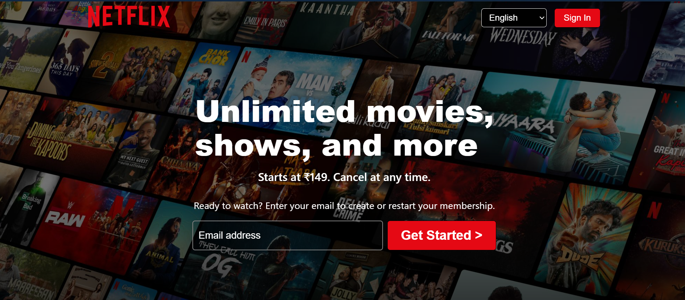
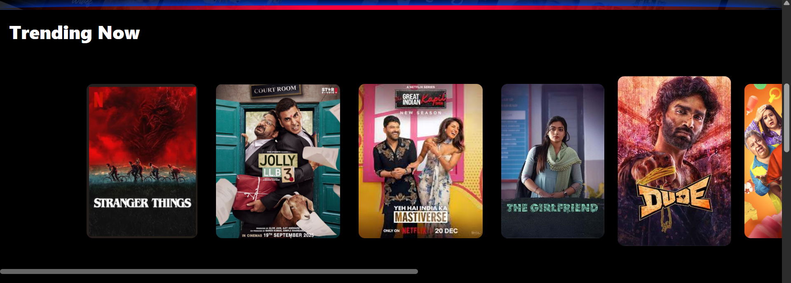
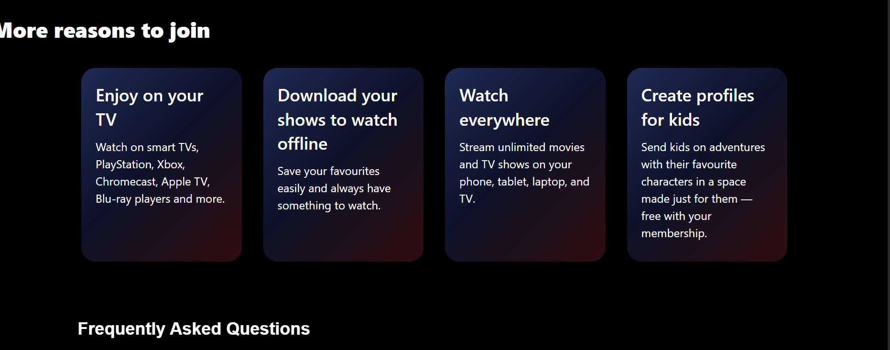
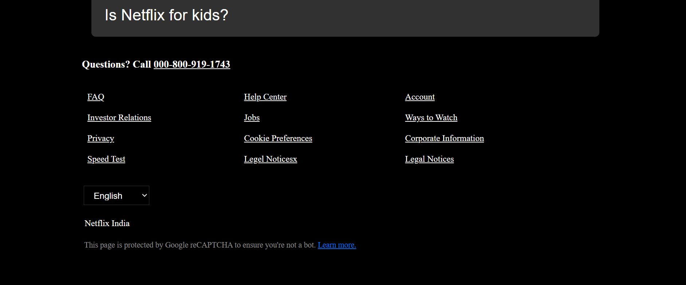

# StreamFlix UI 🎬

A modern Netflix-inspired streaming platform UI built using pure HTML and CSS.

This project recreates the cinematic landing page experience of a modern OTT platform with responsive layouts, trending sections, FAQ accordions, glowing UI effects, and sleek dark-themed design aesthetics.

---

## ✨ Features

- Responsive Netflix-inspired landing page
- Cinematic hero section with overlay effects
- Trending movies/shows carousel UI
- FAQ section design
- Modern card-based layouts
- Custom gradient and glow effects
- Clean footer and navigation bar
- Fully built using HTML5 and CSS3

---

## 🛠️ Tech Stack

- HTML5
- CSS3

---

## 📸 Screenshots

### Hero Section

### Trending Section

### Features Section

### Footer & FAQ

---

## 📚 What I Learned

- Advanced CSS positioning
- Responsive layouts
- Flexbox & Grid systems
- Gradient and glow effects
- UI recreation techniques
- Modern frontend design principles

---

## 🚀 Future Improvements

- Add JavaScript interactions
- Add movie slider functionality
- Add authentication UI
- Improve mobile responsiveness
- Convert into React application

---

## 👨‍💻 Author

**Devam Patel**

GitHub: https://github.com/Devampatel028
